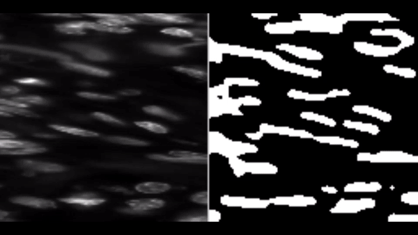

# Kaggle-Data-Science-Bowl-2018

This repository is the implementation of paper [U-Net: Convolutional Networks for Biomedical Image Segmentation](https://arxiv.org/abs/1505.04597) written by Olaf Ronneberger, Philipp Fischer, Thomas Brox.

## Introduction
### Spot Nuclei. Speed Cures.
Imagine speeding up research for almost every disease, from lung cancer and heart disease to rare disorders. The 2018 Data Science Bowl offers our most ambitious mission yet: create an algorithm to automate nucleus detection.

We’ve all seen people suffer from diseases like cancer, heart disease, chronic obstructive pulmonary disease, Alzheimer’s, and diabetes. Many have seen their loved ones pass away. Think how many lives would be transformed if cures came faster.

By automating nucleus detection, we could help unlock cures faster—from rare disorders to the common cold.

I know I am little late to the party but learning has no deadline or time limit. For more information visit [here](https://www.kaggle.com/c/data-science-bowl-2018).

## Getting Started

These instructions will get you a copy of the project up and running on your local machine for development and testing purposes.

### Installation and Setup

* Fork the repo and clone it.
```
git clone https://github.com/Raghav1503/Kaggle-Data-Science-Bowl-2018.git
```
* Go in the repo and setup virtual environment using `python -m virtualenv env` or by using anaconda <br />`conda create --name env`  
* Then activate the environment using `source env/Scripts/activate` (For Windows Users using CMD or Powershell `env/Scripts/activate`) or
`conda activate env`
* Then install the necessary required packages from requirements.txt
```
pip install -r requirements.txt
```
* Then run `pre-commit install`. It will install pre-commit hook for various configurations.

## Result

